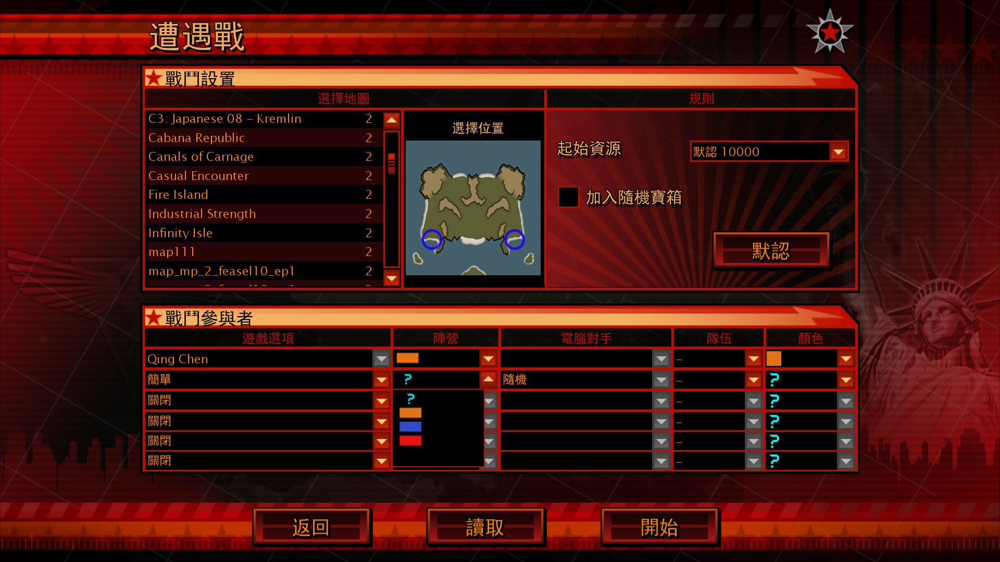
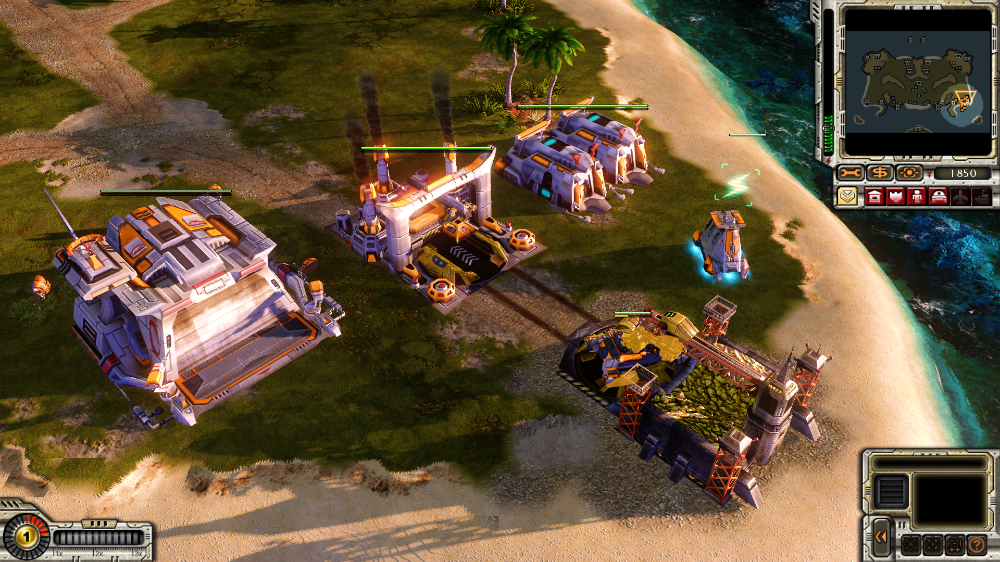
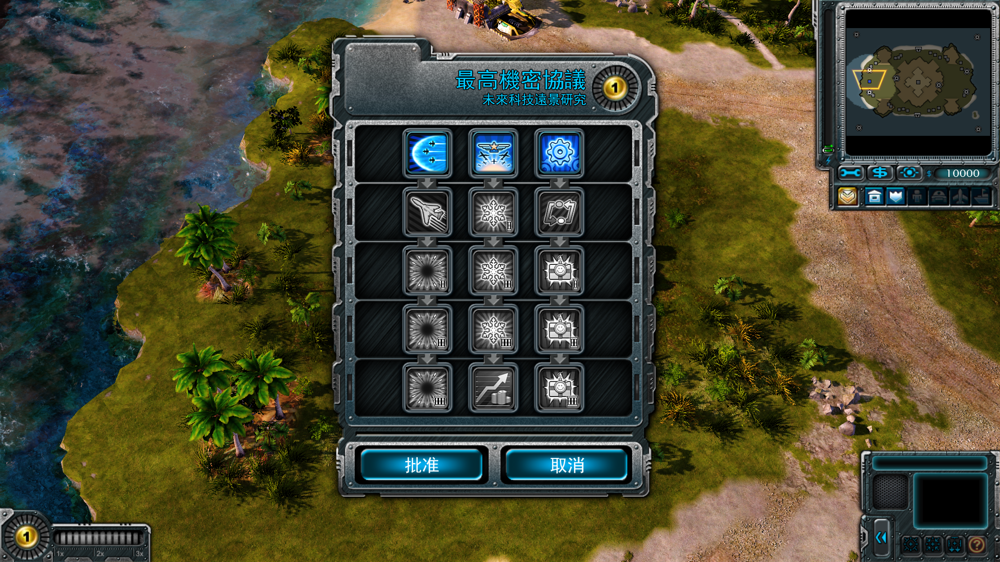
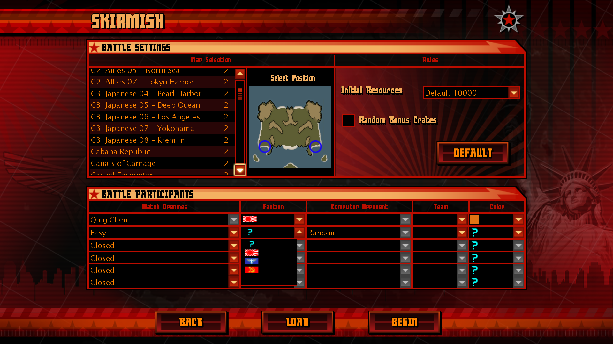
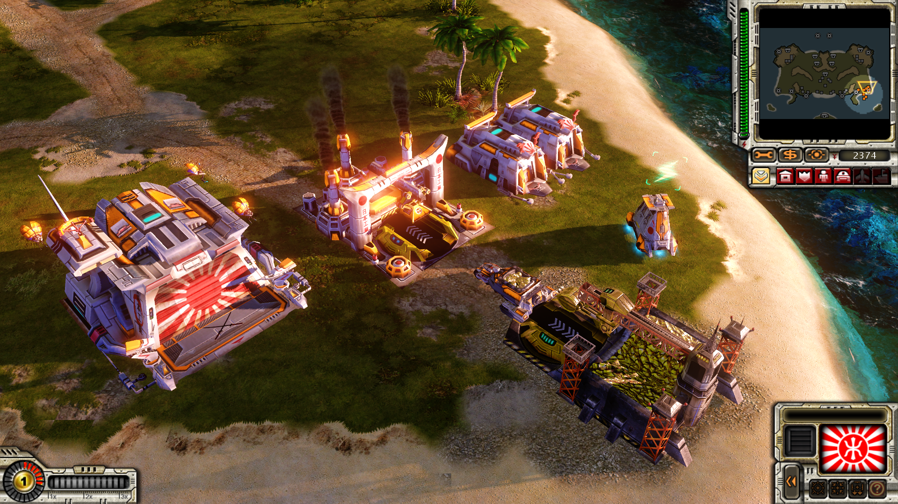
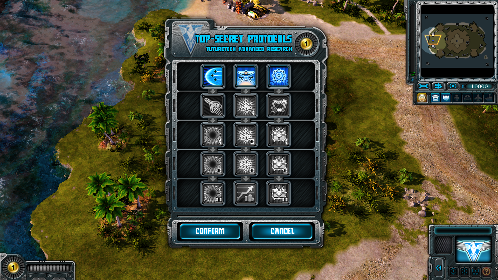

# QCUI

《終極動員令：紅色警戒3》政治元素內容躲過中國視頻網站政治審查的完美解決方案

## 語言

[English Translated by Google](./READMES/README.eng.md) | 繁體中文

## 特性說明

在中國的某些視頻網站，原版的部分元素會被審覈判定為「涉及不適宜內容」而導致影片遭到下架。

而這款補丁計劃將原版中的幾乎所有政治元素（如帝國單位上的旭日旗及全部文字、蘇聯單位上的黨旗和紅星等）全部刪除，會大大提高影片的審覈通過率，並且不會在對戰時造成數據不同步現象。

## 對比圖

| 補丁 | 原版 |
| ---- | ---- |
|||
|||
|||
|||

## 使用方法

用文檔處理程序打開遊戲文件夾下的「RA3_語言_1.12.SkuDef」（如「RA3_chinese_t_1.12.SkuDef」）文件，並在第二行插入「add-big QCUI_版本號.big」（如「add-big QCUI_1.1.big」）語句，然後保存。

## 更新日誌

1.0 將對戰房間、任務選單、統計資料等界面及帝國雷達處的朝日帝國旗子由日本陸軍旗替換為「港鐵旗」

1.1 將帝國國雷達處的「港鐵旗」替換為了一個更加清晰的版本

1.2 將對戰房間中的「港鐵旗」加了一圈黑色的描邊，使其風格與其他陣營旗子相符合。

2.0 將帝國建築、蘇聯建築上的政治元素全部抹去，並抹去了戰鬥界面、遭遇戰及對戰房間、暫停界面、結束界面上的政治元素。

## 存在的問題

1、暫停界面出現了一點小小BUG，但是完全不影響遊戲。

2、本補丁尚未製作完成，目前僅完成了蘇聯建築、帝國建築的修改工作。盟軍建築、盟軍單位、蘇聯單位、帝國單位、民用建築、民用單位的修改正在進行中。

## 飲水思源

本補丁受到了「墨喵星突突母舰Official」、「7silver」、「Flameheart」的啓發，並受到了包括「靚仔」、「pdz_」、「zyb」、「小琪」等在內的「RAT红警3 Mod制作交流」群及「神州眾議院」群內成員的大力幫助。在此對他們表示感謝。
