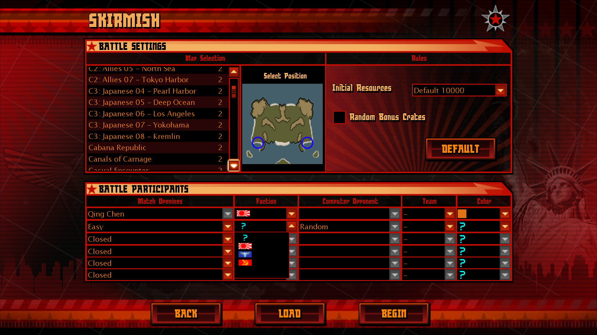
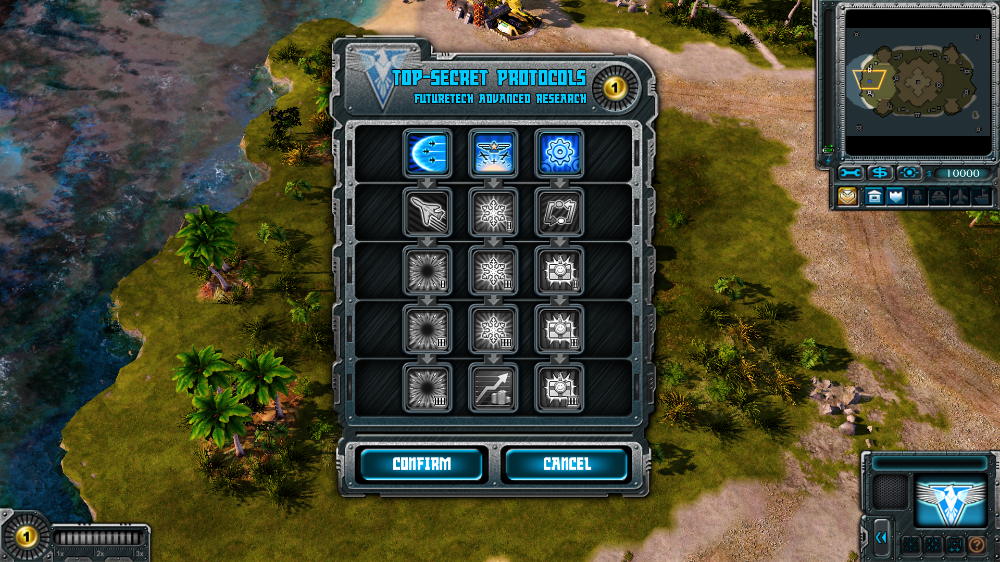

# QCUI

The political elements of Final Mobilization Order: Red Alert 3 are the perfect solution to evade political censorship on Chinese video sites

## Language

English Translated by Google | [繁體中文](../README.md)

## Feature description

On some video sites in China, some elements of the original version are judged to be "inappropriate content" and the video is taken down.

And this mod plan will take almost all the political elements in the original version (such as the rising sun flag and all the text on the imperial unit, the party flag and red star on the Soviet unit, etc.), which will greatly improve the approval rate of the film and will not cause data synchronization in wartime.

## Comparison chart

## How to use

Copy the contents of the MOD file ("QCUI_ version number.big" (such as "QCUI_1.0.big") and "QCUI_ version number.skudef" (such as "QCUI_1.0.skudef)) into the game folder of "Red Alert 3".

2. Open the "RA3_language_1.12.SkuDef" (e.g. "RA3_Chinese_t_1.12.SkuDef") file in the game folder with a document processing program, and insert the "add-big QCUI_version number.big" (e.g. "add-big QCUI_1.1.big") in the second line, and then save.

## Update the journal

1.0 Replace the Asahi Imperial Flag in the battle room, mission menu, statistics and other interfaces and the Imperial Radar from the Japanese Army flag to the "MTR Flag"

1.1 Replace the "MTR flag" at the Imperial Radar with a clearer version

1.2 The "MTR Flag" in the battle room was added with a black stroke to match the other camp flags.

2.0 Erase all political elements from imperial architecture and Soviet architecture, and erase political elements from the battle interface, encounter and battle rooms, suspension interface, and end interface.

## Existing problems

1. There is a small bug in the suspended interface, but it does not affect the game at all.

2. This mod has not yet been produced, and only the revision of Soviet architecture and imperial architecture has been completed. Modifications of Allied buildings, Allied units, Soviet units, imperial units, civilian buildings, civilian units are underway.

## Think of the source of drinking water

This mod was inspired by "墨喵星突突母舰Official", "7silver", "Flameheart", and was greatly helped by members of the "RAT红警3 Mod制作交流" group and "神州眾議院" group including "靚仔", "pdz_", "zyb", "小琪", etc. I would like to thank them.
